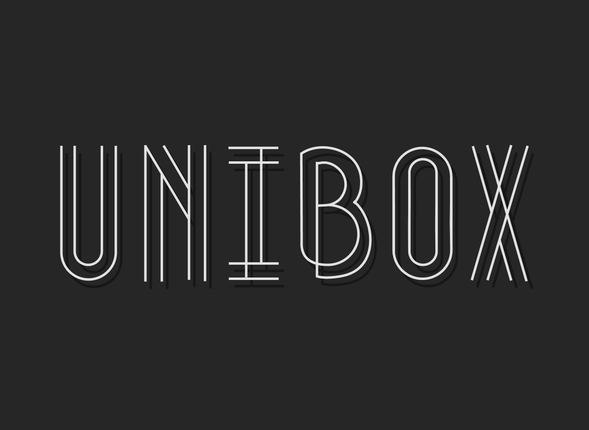
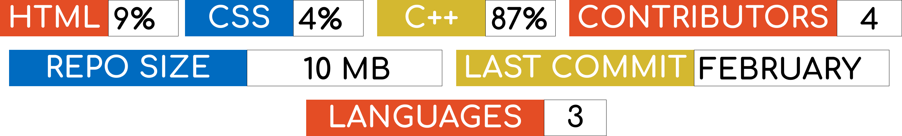

<h1 align="center">Space Expedition</h1>
<br>
<p align="center">
  
  <br>
  <br>
  
</p>
<br>

📋 Description
<p align="start">
UniBox is solar system sandbox where you can experiment with diiferent planets.
</p>
<br>
🖥 Team

>  1. LRRashkov22 - Scrum trainer    
   - GitHub profile: [LRRashkov22](https://github.com/luchezar123)    
 
> 2. AILalev22 - Developer 
   - GitHub profile: [AILalev22](https://github.com/AILalev22)    

> 3. DKrKostadinov22 - Developer   
   - GitHub profile: [DKrKostadinov22](https://github.com/DKrKostadinov22)

> 4. IPVoynov22 - Developer   
   - GitHub profile: [IPVoynov22](https://github.com/IPVoynov22)

   <br> 
   🚀 Languages and tools:
   <br>
   
   
   
    
    
    
    
      
   <br> 
⚙️ Installation 
<br>
Open your CMD and paste this code:
 
````
cd \
git clone https://github.com/codingburgas/2324-space-sprint-project-unibox.git
Open your C: and find the folder named: 2324-space-sprint-project-UniBox
````

<br>

<h1>Enjoy the project!</h1>
